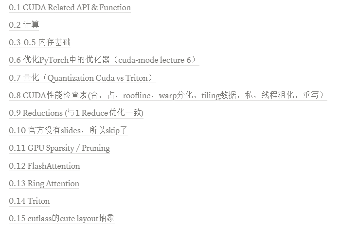

## 前言
愿望：希望自己能够将这个项目持续更新下去，从而能够帮助到更多的人。希望可以有更多人加入本项目(目前每个实现并不是都有讲解，并且还有很多更深入的部分没有涉及，其次就是cuda programming notes太长太杂需要慢慢看慢慢写，最后缺少TVM此类编译器优化的内容)，一起维护，共同进步。
(邮箱：20231083510920@buu.edu.cn, 电话:18621761124)
## revelant note
可以在我的notion中在线阅读笔记(主要是GPU mode的理论知识)
[https://amethyst-cayenne-949.notion.site](https://amethyst-cayenne-949.notion.site/CUDA-168cb70356ad80629a3cd61f59a6dcf2?pvs=4)，目前更新的内容如下：

## 项目目录解释
```
├── code
│   ├── CPU
|   |    ├──0.0 Sync_queue 条件变量实现一个同步队列(线程安全的数据共享区)
│   ├── CUDA
|   |    ├──1.0 Simple example 官方api实现的各类功能
|   |    ├──1.1 Reduce 规约算子优化
|   |    ├──1.2 Test_warp 测试GPU预热
|   |    ├──1.3 MergeSort GPU的归并排序
|   |    ├──1.4 Matmul_shared_memory 使用共享内存对matix的tile做FMA
|   |    ├──1.5 Shared_conflict 解决1.4的bank conflict
|   |    ├──1.6 Stream 使用多个流
|   |    ├──1.7 FlashAttn 注意力领域前沿FlashAttn V1算子的复现
│   ├── TensorRT
|   |    ├──2.1 Generate-onnx 生成onnx
|   |    ├──2.2 Export-onnx 导出onnx
|   |    ├──2.3 Read-parse 解析onnx(用netron看计算图的张量和算子)
|   |    ├──2.4 Export-unsupport-node 怎么导出不支持的算子
|   |    ├──2.5 Onnxsurgeon 用surgeon来获取部分计算图
|   |    ├──2.6 Trtexec 用trtexec指令完成模型的量化部署
|   |    ├──2.7 Mnist-sample 官方的sample
|   |    ├──2.8 Load_model 加载模型
|   |    ├──2.9 Infer_model 推理模型
|   |    ├──2.10 Custom-trt-plugin 写tensorRT不支持的简称plugin
├── cuda_programming notes 英伟达《CUDA C++ Programming Guide》官方文档的阅读笔记
│   ├── img 存放书中插图
│   ├── xxxxxx.md 存放书中每章的学习笔记
├── code-mode 这里是可以找到cuda-mode目前0-15章节的笔记以及reduce优化的实验
```
## How 2 install this repo
```sh
git clone https://github.com/leoda1/the-notes-of-cuda-programming.git
```
## How 2 use code
单个的cu文件用NVCC直接编译成可执行文件即可，例如运行:./code/CUDA/Simple example/GPU_Cache.cu 在terminal中输入
```sh
nvcc GPU_Cache.cu -o name
./name
```
如果是./code/CUDA/1.1-1.7节的代码，就要使用cmake来构建和编译整个项目了。例如
/code/CUDA/1.2 Test_warp用的是cmake构建, 按照下面指令运行
```sh
cmake -B build -G "Visual Studio 16 2019" #我是用的visual studio 2019来构建
cmake --build build # 编译代码
.\build\Debug\your_project.exe #运行Debug版本的可执行文件
```
这里在csdn写了blog记录了怎么用cmake运行, 文章链接
* [如果你是windows + vscode + cuda + tensorRT点击这里](https://blog.csdn.net/buuliuda/article/details/139101651?spm=1001.2014.3001.5502)。
* [如果你是wsl / linux + vscode + cuda + tensorRT点击这里](https://blog.csdn.net/buuliuda/article/details/144903013?spm=1001.2014.3001.5501)

## 参考资料
- [CUDA C++ Programming Guide](https://docs.nvidia.com/cuda/cuda-c-programming-guide/index.html)
- [CUDA Toolkit Documentation](https://docs.nvidia.com/cuda/)
- [NVIDIA CUDA Samples（官方在github上的项目，正在看）](https://github.com/NVIDIA/cuda-samples)