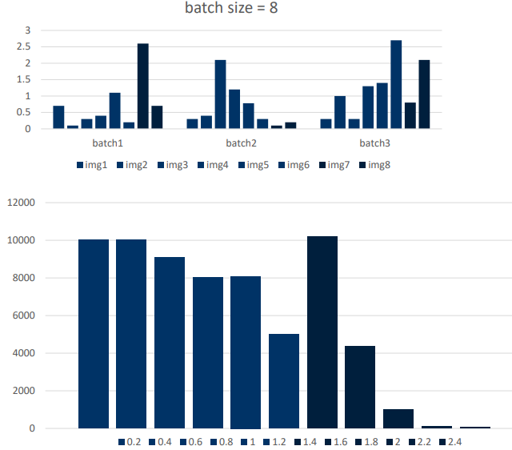

### **模型部署的基础知识：**
#### 1. 指标
#### FLOPS(Floating point number operations per second)：
- 一秒钟可以处理的浮点数运算的次数
- 衡量计算机硬件性能与计算能力的单位

#### TOPS(Tera operations per second)：
-  指的是一秒钟可以处理的整型运算的次数
-  衡量计算机硬件性能、计算能力的一个单位

#### 2. 模型部署误区
因为FLOPs只是模型计算大小的单位,还需要考虑
- 访存量
- reshape, shortcut, nchw2nhwc等等
- 前处理、后处理这些耗时操作

存在TensorRT尚未支持的算子,需要自己写自己写plugin

使用Tensor Core需要让tensor size为8或者16的倍数,不然会有性能损失
- 8的倍数:  fp16
- 16的倍数: int8

对使用TensorRT得到的推理引擎做benchmark和profiling
- 使用TensorRT得到推理引擎并实现infer只是优化的第一步
- 要使用NVIDIA提供的benchmark tools进行profiling(分析模型瓶颈在哪里，分析模型可进一步优化的地方在哪里， 分析模型中多余的memory access在哪里)
- 工具: nsys, nvprof, dlprof, Nsight

#### 3. 量化

quantization granularity:
- 对于activations, 选择per-tensor
- 对于weights, 选择per-channel

#### 4. 校准
- weight的calibration, 选minmax
- activation的calibration, 选entropy或者percentile

batchsize稍微高一些会更好 nvidia会将最大的新出现的数平方 所以当batchsize大 每个数字都有 比如1.5平方后2.25 当batch出现2的时候就不用去更新直方图最大值了。

#### 5. PTQ和量化分析
据量化的时机，一般我们会把量化分为
- PTQ(Post-Training Quantization),  训练后量化
- QAT(Quantization-Aware Training), 训练时量化

#### 6. QAT和量化分析
QAT(Quantization Aware Training)也被称作显式量化。我们明确的在模型中添加Q/DQ节点(量化/反量化)，来控制某一个算子的精度。并且通过fine-tuning来更新模型权重，让权重学习并适应量化带来的精度误差。 

#### 7. 模型剪枝（pruning）
对权重中一些意义不大的权重skip掉不参与计算。

