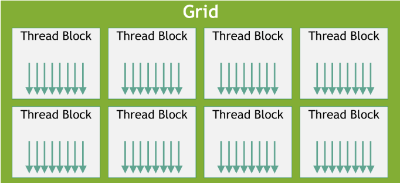
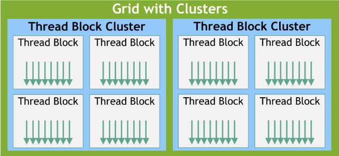

# Chapter 5. programming model

## 简介
英伟达 《CUDA C++ Programming Guide》 官方文档学习记录笔记 版本【Release 12.4】出版时间【 Apr 22, 2024】

## 目录
- [Chapter 5. programming model](#chapter-5-programming-model)
  - [简介](#简介)
  - [目录](#目录)
- [5.1 kernels](#51-kernels)
- [5.2 Thread Hierarchy线程分级结构](#52-thread-hierarchy线程分级结构)
  - [5.2.1 Thread Block Clusters线程块集群](#521-thread-block-clusters线程块集群)

# 5.1 kernels
**前言：**
1.定义：CUDA C++通过定义C++函数拓展C++，称为内核（kernels）。调用该内核时，由N个不同的cuda线程并行执行N次。
2.__global__来定义内核，<<<和>>>来执行配置。
3.执行时每个线程（thread）有一个单独ID，该ID可以由内置变量再内核内访问。
```cpp
//定义kernel
#include<cuda_runtime.h>
#include<iostream>

__global__ void Vecadd(float* A, float* B, float* C)
{
    int i = threadIdx.x;
    C[i] = A[i] + B[i];
}

int main()
{
    //N个线程的内核调用，这里的每个线程都会执行一次C[i] = A[i] + B[i]的加法操作
    VecAdd<<<1, N>>>(A, B, C);
    return 0;
}
```
# 5.2 Thread Hierarchy线程分级结构
上一个代码当中的threaIdx.x就是当前线程在块中的索引，它表示线程在线程块中的位置。线程块（thread block）：由N个线程组成的集合，每个线程块都有自己的线程ID。可以用一维，二维和三维的线程块对线程进行划分，线程块的大小由用户指定。这就有了一种自然的方式去计算向量、矩阵等等。
对于一维块，线程的索引和线程的ID是一致的；对于二维块（Dx，Dy），线程的索引是（x, y）对应的线程ID是(x + y*Dx)；对于三维块（Dx，Dy，Dz），线程的索引是（x, y, z）对应的线程ID是(x + y*Dx + z*Dx*Dy)。
```cpp
//
//kernal defination
#include <iostream>

#define N 3  //matrix size
__global__ void MatAdd(float A[N][N], float B[N][N]
                       , float C[N][N]) {
    int i = threadIdx.x;
    int j = threadIdx.y;
    C[i][j] = A[i][j] + B[i][j];
}

int main() {
    //Kernal invocation with ONE block of N*N*1 threads
    float A[N][N] = { {1, 2, 3}, {4, 5, 6}, {7, 8, 9} };
    float B[N][N] = { {9, 8, 7}, {6, 5, 4}, {3, 2, 1} };
    float C[N][N];
    
    int numThreads = 1;
    dim3 threadsPerBlock(N, N);
    MatAdd<<<numThreads, threadsPerBlock>>>(A, B, C);
    //CUDA同步函数，执行完核函数后继续执行主机程序
    cudaDeviceSynchronize();
    std::cout << "Matrix C:" << std::endl;
    for (int i = 0; i < N; i++) {
        for (int j = 0; j < N; j++) {
            std::cout << C[i][j] << " ";
        }
        std::cout << std::endl;
    }
    return 0;
}
```
```bash
PS C:\Users\22681\Desktop\project\cudalearn> .\build\Debug\hellocuda.exe
Matrix C:
-1.07374e+08 -1.07374e+08 -1.07374e+08
-1.07374e+08 -1.07374e+08 -1.07374e+08
-1.07374e+08 -1.07374e+08 -1.07374e+08(这里的结果不是每个元素都是10，因为threadIdx.x是线程在块中的index不是在矩阵中的index
```
每个块（block）的线程数是有限的，因为所有块都想驻留在同一个核心上。同时，一个内核可以在多个块上并行执行，这样就可以让线程总数等于块数乘以线程数。一个块当中是由一维，二维或三维的网格构成，网格中线程块的数量通常由正在处理的数据的大小决定。
<p align="center">
  
</p>
<p align="center">线程与网格图示</p>
在 CUDA 编程中，启动内核函数时需要指定线程块的数量或每个线程块中线程的数量。这些数量可以是简单的整数（int）或三维向量（dim3）类型。指定线程块用内置变量：blockIdx，指定线程块的维度用内置变量：blockDim。

```cpp
//kernal defination
#include <iostream>

#define N 3  //matrix size
__global__ void MatAdd(float A[N][N], float B[N][N]
                       , float C[N][N]) {
    //blockIdx.x为线程块的编号，blockDim.x为线程块的大小，threadIdx.x为线程的编号
    int i = blockIdx.x * blockDim.x + threadIdx.x;
    int j = blockIdx.y * blockDim.y + threadIdx.y;
    if (i < N && j < N)
        C[i][j] = A[i][j] + B[i][j];
}

int main() {
    //Kernal invocation with ONE block of N*N*1 threads
    float A[N][N] = { {1, 2, 3}, {4, 5, 6}, {7, 8, 9} };
    float B[N][N] = { {9, 8, 7}, {6, 5, 4}, {3, 2, 1} };
    float C[N][N];
    //设置线程块的大小为3*3
    dim3 threadsPerBlock(3, 3);
    //设置线程块的数量为N/3
    dim3 numBlocks(N / threadsPerBlock.x, N / threadsPerBlock.y);
    MatAdd<<<numBlocks, threadsPerBlock>>>(A, B, C);
    //CUDA同步函数，执行完核函数后继续执行主机程序
    cudaDeviceSynchronize();
    std::cout << "Matrix C:" << std::endl;
    for (int i = 0; i < N; i++) {
        for (int j = 0; j < N; j++) {
            std::cout << C[i][j] << " ";
        }
        std::cout << std::endl;
    }
    return 0;
}
```
这里原文PDF提到使用线程块内的线程可以通过共享内存来共享数据并通过同步它们的执行来协调内存访问。这里是通过__syncthreads()函数来实现的。__syncthreads()函数会等待所有线程都到达该函数调用处，然后再继续执行。线程同步原语参考：Cooperative Groups API，它提供了一组丰富的线程同步原语。
## 5.2.1 Thread Block Clusters线程块集群
线程块集群中的不同线程块在GPU处理集群中的共同调度与“线程块中的不同线程在流式多处理器上共同调度相似”。线程块集群也有一维，二维和三维。一个集群最多支持8个线程块。见下图：
<p align="center">
  
</p>
<p align="center">线程块集群示意图</p>
线程块集群俩种使用方式。一，使用__cluster_dims__(X, Y, Z)来指定线程块集群的大小。二，使用cuda内核启动的API，cudaLaunchKernelEx。接下来，示例代码展示用编译器时间内核启动集群。如果内核使用编译时集群大小，则在启动内核时无法修改集群大小。

```cpp
∕∕ Kernel definition 官方给的代码
∕∕ Compile time cluster size 2 in X-dimension and 1 in Y and Z dimension
_global__ void __cluster_dims__(2, 1, 1) cluster_kernel(float *input, float* output) { }
int main() 
{
    float *input, *output;
    ∕∕ Kernel invocation with compile time cluster sizedim3 threadsPerBlock(16, 16); 
    dim3 numBlocks(N ∕ threadsPerBlock.x, N ∕ threadsPerBlock.y);
    ∕∕ The grid dimension is not affected by cluster launch, and is still enumerated ∕∕ using number of blocks. ∕∕ The grid dimension must be a multiple of cluster size.
    cluster_kernel<<<numBlocks, threadsPerBlock>>>(input, output); 
}
//这里的__cluster_dims__(2, 1, 1)本人没成功但是删去后，直接定义集群内核却可以，如下代码：
//kernal defination
#include <cuda_runtime.h>
#include <iostream>
#define N 3
__global__ void cluster_kernel(float *input, float *output)
{
    int idx = blockIdx.x * blockDim.x + threadIdx.x + (blockIdx.y * blockDim.y + threadIdx.y) * gridDim.x * blockDim.x;
    if (idx < N) {
        output[idx] = input[idx] * 2; 
    }
}

int main() {
    float *input, *output;
    float hostInput[N] = {1.0, 2.0, 3.0};
    cudaMalloc((void**)&input,  N * sizeof(float));
    cudaMemcpy(input, hostInput, N * sizeof(float), cudaMemcpyHostToDevice);
    cudaMalloc((void**)&output, N * sizeof(float));
    //设置线程块的大小为3*3
    dim3 threadsPerBlock(3, 3);
    //设置线程块的数量为N/3
    dim3 numBlocks((N + threadsPerBlock.x - 1) / threadsPerBlock.x, (N + threadsPerBlock.y - 1) / threadsPerBlock.y);
    cluster_kernel<<<numBlocks, threadsPerBlock>>>(input, output);
    // 在完成后记得释放内存
    cudaFree(input);
    cudaFree(output);
}
```
文档内给了另一种实现方法，用cudaLaunchKernelEx这个API，最后成功实现了使用线程块集群计算简单矩阵。
```cpp
//kernal defination
#include <cuda_runtime.h>
#include <iostream>
#define N 3

__global__ void cluster_kernel(float *input, float *output)
{
    int idx = threadIdx.x + blockIdx.x * blockDim.x;
    if (idx < N) {
        output[idx] = input[idx] * 2.0f;
    }
}

int main() {
    float *input, *output;
    // 为输入和输出数组分配设备内存
    cudaMalloc((void**)&input, N * sizeof(float));
    cudaMalloc((void**)&output, N * sizeof(float));

    // 示例输入数据
    float h_input[N] = {1.0f, 2.0f, 3.0f};
    cudaMemcpy(input, h_input, N * sizeof(float), cudaMemcpyHostToDevice);
    
    dim3 threadsPerBlock(1, 1);
    dim3 numBlocks(N, 1);
    cudaLaunchConfig_t config = {0};
    config.gridDim = numBlocks;
    config.blockDim = threadsPerBlock;

    cudaLaunchAttribute attribute[1];
    attribute[0].id = cudaLaunchAttributeClusterDimension;
    attribute[0].val.clusterDim.x = 2;
    attribute[0].val.clusterDim.y = 1;
    attribute[0].val.clusterDim.z = 1;
    config.attrs = attribute;
    config.numAttrs = 1;

    void *args[] = { &input, &output };
    cudaLaunchKernelExC(&config, cluster_kernel, args);
    
    cudaDeviceSynchronize();
    float h_output[N];
    cudaMemcpy(h_output, input, N * sizeof(float), cudaMemcpyDeviceToHost);
    for (int i = 0; i < 3; ++i) {
        std::cout << "Output[" << i << "] = " << h_output[i] << std::endl;
    }

    // 清理设备内存
    cudaFree(input);
    cudaFree(output);
    return 0;
}
// static __inline__ __host__ cudaError_t cudaLaunchKernelExC(const cudaLaunchConfig_t *config,
//                                                                const void *func,
//                                                                  void **args)
// 这是代码库中找到的cudaLaunchKernelExC函数，文档中的cudaLaunchKernelEx有问题。
```